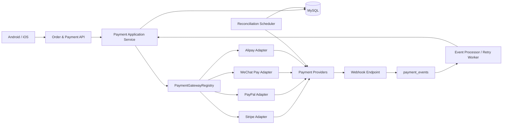
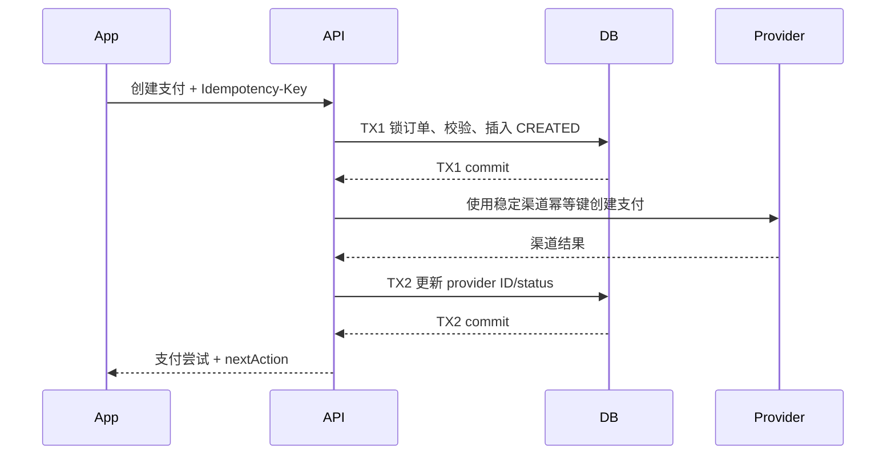

# 多渠道支付功能落地开发文档

> 文档版本：2026-08-06  
> 当前阶段：统一支付内核已落地，真实支付渠道适配器待接入  
> 适用范围：`joysong-server`、Android、iOS/Flutter、管理后台  
> 前端接口手册：[`PAYMENT_ORDER_FRONTEND_API.md`](./PAYMENT_ORDER_FRONTEND_API.md)  
> 订单流程基准：[`order_dispute_flow.puml`](../doc/order_dispute_flow.puml)

## 1. 文档目标

本文档用于指导娇颜颂订单支付从当前 DEMO 流程迭代到可生产运行的境内外多渠道支付系统，明确：

- 当前已经完成的代码、数据库和接口能力；
- Stripe、PayPal、微信支付、支付宝的接入顺序与职责边界；
- 支付、回调、退款、对账和结算的实现要求；
- Android 与 iOS/Flutter 联调所需服务端契约；
- 安全、测试、灰度、监控和上线验收标准。

本文档不把支付平台的“客户端返回成功”视为订单支付成功。支付结果必须以服务端主动查询或验签后的异步通知为准。

## 2. 当前落地状态

### 2.1 完成情况

| 能力 | 状态 | 当前实现 |
| --- | --- | --- |
| V1 支付数据库 | 已完成 | 已合并订单金额快照、支付尝试、支付事件、退款明细、结算快照 |
| 订单金额最小单位 | 已完成 | 新订单同时写十进制兼容字段和 `*_minor` 字段 |
| 多支付尝试 | 已完成 | 一条 `payments` 代表一次渠道支付尝试 |
| 用户级幂等 | 已完成 | 数据库唯一键 `(user_id, idempotency_key)` |
| 支付渠道抽象 | 已完成 | `PaymentGateway`、`PaymentGatewayRegistry` |
| 支付短事务编排 | 已完成 | 创建尝试、渠道调用、结果落库分为三个阶段 |
| 前端下一步动作 | 已完成 | 统一返回 Stripe/跳转/微信/支付宝 `nextAction` |
| 支付查询与确认 | 已完成 | 支付详情、订单最新支付、主动刷新、确认接口 |
| DEMO 渠道 | 已完成 | 仅开发环境同步成功，生产环境安全关闭 |
| Flutter Android/iOS 支付页 | DEMO 已完成 | 已接统一支付接口、幂等、状态恢复/轮询、双语页面和安全渠道开关 |
| 支付异步事件收件箱 | 已完成 | `payment_events` 按渠道事件 ID 防重 |
| 订单支付状态推进 | 已完成 | 面诊金、尾款成功后按状态机推进 |
| 退款业务单 | 已完成 | `refunds` 保存审核、原因、金额和原订单状态 |
| 原路退款拆分 | 已完成 | `refund_items` 按原支付记录分别退款 |
| 结算金额快照 | 已完成 | 十进制与最小单位双写 |
| Stripe | 待开发 | 仅保留枚举和适配器入口 |
| PayPal | 待开发 | 仅保留枚举和适配器入口 |
| 微信支付 | 待开发 | 仅保留枚举和适配器入口 |
| 支付宝 | 待开发 | 仅保留枚举和适配器入口 |
| 支付主动查询/状态收敛 | 已完成 | 定时查询超时支付和处理中退款 |
| 失败事件自动重试 | 已完成 | 最多 10 次，通过渠道主动查询收敛可信状态 |
| 渠道日账单对账 | 待开发 | 待真实渠道适配器接入后实现 |

### 2.2 当前可运行范围

- `dev`：`payment.mode=demo`，可以跑通订单创建、面诊金、到店核验、尾款、退款和结算流程；
- `prod`：`payment.mode=disabled`，所有未接入渠道安全失败，不会产生虚假支付成功；
- 当前真实资金不会通过 Stripe、PayPal、微信或支付宝划转。

### 2.3 生产上线前 P0 阻断项

统一内核 P0 已完成。真实渠道启用前仍需解决：

1. 实现对应渠道 SDK/API 适配器以及 webhook 原始报文验签；
2. 完成渠道专用回调应答格式、商户号/应用 ID 校验；
3. 增加渠道沙箱集成测试、并发故障恢复测试和日账单对账；
4. 配置生产密钥、回调地址、渠道开关、限额、监控和告警。
5. 提供渠道能力发现接口，并保证 `REQUIRES_ACTION` 支付可恢复取得安全的 `nextAction`。

## 3. 渠道策略

### 3.1 推荐接入顺序

| 优先级 | 渠道 | 目标市场 | 服务端模式 |
| --- | --- | --- | --- |
| P0 | Stripe | 海外银行卡、Apple Pay、Google Pay、部分本地支付方式 | PaymentIntents + 移动端 PaymentSheet/SDK |
| P1 | PayPal | 海外 PayPal 钱包用户 | Orders v2 + redirect/SDK + server capture |
| P1 | 微信支付 | 中国大陆微信用户 | API v3 APP/JSAPI，根据客户端形态选择 |
| P1 | 支付宝 | 中国大陆支付宝用户 | App 支付 2.0/网页支付 |

Stripe PaymentIntent 能覆盖支付生命周期和额外身份验证，官方建议服务端通过 webhook 监控最终成功或失败，并对创建请求使用幂等键。[Stripe PaymentIntents](https://docs.stripe.com/payments/payment-intents)

PayPal 使用 Orders v2 创建订单，买家批准后由服务端 capture；创建和 capture 请求使用 `PayPal-Request-Id` 防止重复执行。[PayPal Orders v2](https://developer.paypal.com/docs/api/orders/v2/)

微信支付 API v3 下单返回 `prepay_id`，支付成功后通过异步通知确认；回调必须验签并校验订单金额。[微信支付 API v3](https://pay.wechatpay.cn/doc/v3/merchant/4012791897)

支付宝 App 支付通过 `notify_url` 接收异步通知，商户必须对通知中的签名进行验证。[支付宝 App 支付接入指南](https://aipay.alipay.com/docs/mobile-app-pay/app-pay-integration-guide-new.html)

### 3.2 渠道职责边界

业务服务只负责：

- 校验订单、用户、支付阶段和应付金额；
- 生成本地支付尝试和稳定幂等键；
- 调用统一渠道接口；
- 验证渠道返回的订单号、币种和金额；
- 根据可信事件推进本地支付和订单状态。

渠道适配器负责：

- 组装渠道请求；
- 管理渠道认证和请求签名；
- 将本地最小金额单位转换为渠道金额格式；
- 将渠道状态转换为统一 `PaymentStatus`；
- 验证 webhook 签名并解析事件；
- 创建退款、查询支付和查询退款。

移动端不得持有 Stripe secret key、PayPal client secret、微信商户私钥、支付宝应用私钥或 webhook secret。

## 4. 总体架构



核心原则：

- 订单是业务事实，支付是资金事实，两者通过服务层状态推进关联；
- 一次订单阶段允许多次支付尝试，但只能有一个最终成功结果；
- 客户端结果不是最终资金事实；
- webhook 可重复、乱序、延迟到达，处理必须幂等；
- 退款按原成功支付记录拆分执行；
- 所有金额在渠道边界使用最小货币单位整数。

## 5. 数据库设计与职责

### 5.1 `orders`

订单表保存下单时的金额和币种快照：

| 字段 | 用途 |
| --- | --- |
| `currency` | ISO-4217 币种代码 |
| `total_amount_minor` | 订单应付总额 |
| `paid_amount_minor` | 累计已付金额 |
| `consultation_fee_minor` | 面诊金 |
| `discount_amount_minor` | 优惠金额 |
| `remaining_amount_minor` | 尾款 |
| `pricing_country` | 定价国家/地区 |

十进制字段暂时保留用于现有接口和历史代码兼容。新业务计算必须优先使用 `*_minor`。

### 5.2 `payments`

一条记录表示一次渠道支付尝试，不表示整个订单只有一笔支付。

关键约束：

- `(user_id, idempotency_key)` 唯一：客户端重试防重复；
- `(provider, provider_payment_id)` 唯一：渠道支付对象防重复；
- `(order_id, payment_type, status)` 索引：按订单阶段查询成功记录；
- `refunded_amount_minor <= amount_minor`：退款金额不能超过原支付金额；
- `@Version`/`version`：并发更新保护。

重要字段：

| 字段 | 用途 |
| --- | --- |
| `payment_type` | `CONSULTATION_FEE`、`BALANCE` |
| `provider` | `DEMO`、`STRIPE`、`PAYPAL`、`WECHAT_PAY`、`ALIPAY` |
| `payment_method` | `CARD`、`PAYPAL`、`WECHAT_APP` 等展示/分析值 |
| `provider_payment_id` | Stripe PaymentIntent ID、PayPal Order ID 等 |
| `provider_transaction_id` | Stripe Charge ID、PayPal Capture ID 等最终交易号 |
| `idempotency_key` | 用户请求幂等键 |
| `failure_code/message` | 渠道失败信息 |
| `expires_at` | 支付动作过期时间 |

### 5.3 `payment_events`

支付事件收件箱保存渠道原始 JSON，用于防重、审计、重放和故障恢复。

处理状态建议固定为：

- `RECEIVED`：已验签并入库；
- `PROCESSED`：业务处理完成；
- `FAILED`：业务处理失败，等待重试；
- `DEAD`：达到最大重试次数，进入人工处理。

生产实现应先完成验签再写 `signature_valid=true`。无效签名只记安全日志，不写入可重放的有效事件队列。

### 5.4 `refunds` 与 `refund_items`

- `refunds`：业务退款申请、平台审核和用户可见汇总；
- `refund_items`：针对每一笔原支付执行的实际渠道退款。
- 退款原因码约束通过增量迁移 `V3__add_refund_reason_code_constraint.sql` 增加，不再修改 V1 基线。

例如订单面诊金经 Stripe 支付、尾款经 PayPal 支付，全额退款时生成一个 `refunds` 和两个 `refund_items`，分别调用 Stripe Refund 和 PayPal Capture Refund。

PayPal 对 captured payment 使用 `/v2/payments/captures/{capture_id}/refund`，并支持 `PayPal-Request-Id` 幂等头。[PayPal Payments v2](https://developer.paypal.com/docs/api/payments/v2/)

Stripe 退款后会产生退款状态事件，渠道适配器需要处理退款创建和状态变化事件。[Stripe Refunds](https://docs.stripe.com/refunds)

### 5.5 `settlements`

当前结算是账面分账记录，不代表实际渠道资金划转。用户端不展示 `PENDING_SETTLEMENT` 和 `SETTLED`，统一显示为 `COMPLETED`。

后续真实分账必须单独评估：

- Stripe Connect/平台型账户资质；
- 微信/支付宝服务商分账能力；
- PayPal multiparty 能力；
- 医生、机构、咨询师主体资质和税务协议。

未经合规与商户能力确认，不得把账面 `SETTLED` 等同于真实资金已转账。

## 6. 统一领域状态

### 6.1 支付状态

| 统一状态 | 含义 | 可否推进订单 |
| --- | --- | --- |
| `CREATED` | 本地尝试已创建 | 否 |
| `REQUIRES_ACTION` | 等待 3DS、跳转或 SDK 操作 | 否 |
| `PROCESSING` | 渠道处理中 | 否 |
| `SUCCEEDED` | 渠道确认支付成功 | 是 |
| `FAILED` | 支付失败 | 否 |
| `CANCELLED` | 支付取消 | 否 |
| `EXPIRED` | 支付过期 | 否 |
| `PARTIALLY_REFUNDED` | 部分退款 | 否 |
| `REFUNDED` | 全额退款 | 否 |

禁止将 `REQUIRES_ACTION`、`PROCESSING` 或客户端 SDK 返回成功直接映射为 `SUCCEEDED`。

### 6.2 渠道状态映射

#### Stripe

| Stripe PaymentIntent | 统一状态 |
| --- | --- |
| `requires_payment_method` | `FAILED` 或 `REQUIRES_ACTION`，按错误上下文判断 |
| `requires_confirmation` | `REQUIRES_ACTION` |
| `requires_action` | `REQUIRES_ACTION` |
| `processing` | `PROCESSING` |
| `requires_capture` | `PROCESSING`，如采用手动 capture |
| `succeeded` | `SUCCEEDED` |
| `canceled` | `CANCELLED` |

最终成功事件至少处理 `payment_intent.succeeded`，失败处理 `payment_intent.payment_failed`，退款处理对应 refund/charge 事件。Stripe 要求使用原始请求体、`Stripe-Signature` 和 endpoint secret 验签。[Stripe Webhook 签名](https://docs.stripe.com/webhooks/signature)

#### PayPal

| PayPal | 统一状态 |
| --- | --- |
| Order `CREATED` / `PAYER_ACTION_REQUIRED` | `REQUIRES_ACTION` |
| Capture `PENDING` | `PROCESSING` |
| Capture `COMPLETED` | `SUCCEEDED` |
| Capture `DECLINED` / `FAILED` | `FAILED` |
| Capture `PARTIALLY_REFUNDED` | `PARTIALLY_REFUNDED` |
| Capture `REFUNDED` | `REFUNDED` |

PayPal webhook 必须验证 transmission headers、webhook ID 和原始请求体；也可以调用 PayPal 的 verify-webhook-signature 接口。[PayPal Webhook 验证](https://developer.paypal.com/api/rest/webhooks/rest/)

#### 微信支付

- 下单成功只代表获得 `prepay_id`，统一状态为 `REQUIRES_ACTION`；
- 支付成功通知验签、解密并核对商户号、订单号、币种和金额后才进入 `SUCCEEDED`；
- 使用 `Wechatpay-Timestamp`、`Wechatpay-Nonce`、原始请求体、`Wechatpay-Signature` 和平台证书/公钥验签。[微信支付回调验签](https://pay.wechatpay.cn/doc/v3/merchant/4012791861)

#### 支付宝

- App 支付下单返回 order string，统一状态为 `REQUIRES_ACTION`；
- 验签后的 `TRADE_SUCCESS`/适用产品的成功状态或主动查询成功后进入 `SUCCEEDED`；
- 未收到异步通知时必须调用查询接口确认，不依赖客户端同步返回。[支付宝异步通知](https://aipay.alipay.com/docs/ai-web-app-payment-qianyi/api-list/async-notify-verify.html)

## 7. 目标渠道接口

现有 `PaymentGateway` 已扩展为覆盖创建、查询、确认、退款和回调：

```kotlin
interface PaymentGateway {
    val provider: PaymentProvider

    fun createPayment(request: ProviderCreatePaymentRequest): ProviderPaymentResult
    fun queryPayment(providerPaymentId: String): ProviderPaymentResult
    fun confirmPayment(request: ProviderConfirmPaymentRequest): ProviderPaymentResult
    fun refund(request: ProviderRefundRequest): ProviderRefundResult
    fun queryRefund(providerRefundId: String): ProviderRefundResult
    fun verifyWebhook(payload: String, headers: Map<String, String>): VerifiedProviderEvent
}
```

适配器不得直接更新订单表；它只返回标准化结果，由应用服务统一推进状态。

### 7.1 `ProviderPaymentResult` 目标结构

```kotlin
data class ProviderPaymentResult(
    val status: PaymentStatus,
    val providerPaymentId: String,
    val providerTransactionId: String? = null,
    val nextAction: PaymentNextAction? = null,
    val expiresAt: LocalDateTime? = null,
    val failureCode: String? = null,
    val failureMessage: String? = null
)
```

```kotlin
sealed interface PaymentNextAction {
    data class StripeClientSecret(val clientSecret: String) : PaymentNextAction
    data class Redirect(val url: String) : PaymentNextAction
    data class WeChatSdkParams(val params: Map<String, String>) : PaymentNextAction
    data class AlipayOrderString(val orderString: String) : PaymentNextAction
}
```

敏感的下一步参数只在 HTTPS 响应中返回给当前订单用户，不写日志。Stripe client secret 不应作为普通业务字段长期落库。

## 8. 服务端接口迭代

### 8.1 保留接口

```http
POST /api/orders/{orderId}/payment-attempts
```

继续要求 `Idempotency-Key`，响应已增加：

```json
{
  "id": "payment-id",
  "status": "REQUIRES_ACTION",
  "provider": "STRIPE",
  "currency": "USD",
  "amountMinor": 19900,
  "nextAction": {
    "type": "STRIPE_CLIENT_SECRET",
    "clientSecret": "pi_xxx_secret_xxx"
  },
  "expiresAt": "2026-08-06T16:00:00"
}
```

### 8.2 支付查询接口（已实现）

```http
GET /api/payments/{paymentId}
GET /api/orders/{orderId}/payments/latest?paymentType=CONSULTATION_FEE
```

要求：

- 只允许订单所有者或有权管理订单的账号查询；
- 默认返回本地状态；
- `refresh=true` 只在受控频率下触发渠道主动查询；
- 不返回渠道 secret、服务端密钥或完整原始 webhook。

### 8.3 支付确认接口（已实现）

PayPal 买家批准、部分需要服务端确认的支付方式使用：

```http
POST /api/payments/{paymentId}/confirm
```

该接口要求 `Idempotency-Key`。服务端以支付 ID 派生稳定的渠道确认幂等键；Stripe PaymentSheet 默认由客户端确认 PaymentIntent 时，可不调用此接口。

### 8.4 回调接口

```http
POST /api/payment-webhooks/STRIPE
POST /api/payment-webhooks/PAYPAL
POST /api/payment-webhooks/WECHAT_PAY
POST /api/payment-webhooks/ALIPAY
```

实施要求：

- 使用原始字节/字符串请求体验签，不能解析再序列化后验签；
- 验签失败返回 400/401，不推进任何业务状态；
- 验签成功后尽快写收件箱并返回渠道要求的成功响应；
- 复杂业务处理放入异步 worker；
- 同一渠道事件重复到达只能处理一次；
- 对无法识别但验签有效的事件记录为 `IGNORED` 或安全完成，避免渠道无限重试。

当前统一 `BaseResponse` 不一定符合微信/支付宝的回调应答格式。各渠道 Controller 必须按官方协议返回专用 HTTP body，不能共用移动端响应包装。

## 9. 正确事务边界

### 9.1 创建支付



禁止持有订单悲观锁等待第三方网络请求。

渠道请求超时但结果未知时：

1. 不创建第二个本地支付尝试；
2. 使用相同渠道幂等键查询/重试；
3. 本地保持 `PROCESSING`；
4. 等待 webhook 或主动查询收敛最终状态。

### 9.2 支付成功推进

在同一数据库事务中：

1. 锁定 `payments`；
2. 若已成功则幂等返回；
3. 锁定 `orders`；
4. 校验订单阶段、支付币种、支付金额、订单归属；
5. 更新支付为 `SUCCEEDED`；
6. 更新订单 `paid_amount_minor` 和订单状态；
7. 写 `order_status_logs`；
8. 提交事务。

任何回调都不得只凭 `providerPaymentId` 推进订单，还必须比对本地记录的渠道、币种和金额。

### 9.3 退款

退款渠道幂等键使用稳定业务字段：

```text
refund-{refundId}-{paymentId}
```

不能使用每次重试都会变化的新 UUID。

退款执行采用与创建支付相同的短事务拆分方式。渠道退款成功但本地写入失败时，使用相同幂等键查询/重试，不能再次生成新的退款请求。

## 10. 配置与密钥

### 10.1 目标配置结构

```yaml
payment:
  mode: live
  enabled-providers: STRIPE,PAYPAL
  stripe:
    secret-key: ${STRIPE_SECRET_KEY}
    webhook-secret: ${STRIPE_WEBHOOK_SECRET}
    api-version: ${STRIPE_API_VERSION}
  paypal:
    environment: ${PAYPAL_ENVIRONMENT:sandbox}
    client-id: ${PAYPAL_CLIENT_ID}
    client-secret: ${PAYPAL_CLIENT_SECRET}
    webhook-id: ${PAYPAL_WEBHOOK_ID}
  wechat-pay:
    merchant-id: ${WECHAT_PAY_MCH_ID}
    app-id: ${WECHAT_PAY_APP_ID}
    merchant-serial-no: ${WECHAT_PAY_MCH_SERIAL_NO}
    private-key-path: ${WECHAT_PAY_PRIVATE_KEY_PATH}
    api-v3-key: ${WECHAT_PAY_API_V3_KEY}
  alipay:
    app-id: ${ALIPAY_APP_ID}
    private-key: ${ALIPAY_APP_PRIVATE_KEY}
    alipay-public-key: ${ALIPAY_PUBLIC_KEY}
```

### 10.2 安全要求

- 密钥只放在 Secret Manager、容器 secret 或受控环境变量；
- 不提交到 Git，不写入 `.env.example` 的真实值；
- 启动时校验启用渠道的必需配置，缺失则阻止该渠道注册；
- 日志必须脱敏 Authorization、client secret、私钥、webhook secret、支付凭证和用户银行卡信息；
- 生产禁用 `DEMO`；
- webhook URL 只允许 HTTPS；
- PayPal 证书 URL 下载必须校验 HTTPS 主机白名单，防止 SSRF；
- 不在本系统存储卡号、CVC 或完整支付凭证，使用渠道托管 SDK 降低 PCI 范围。

## 11. 对账与状态收敛

### 11.1 主动查询任务

当前 `PaymentReconciliationService` 默认每 60 秒执行一次，查询：

- `CREATED/REQUIRES_ACTION/PROCESSING` 且超过预期时间的支付；
- `REFUND_PROCESSING` 或退款明细 `PROCESSING`；
- webhook 处理失败但未达到重试上限的事件。

查询结果仍必须通过统一应用服务更新，不允许任务直接拼 SQL 修改订单状态。

### 11.2 事件重试

当前失败事件最多重试 10 次，通过支付主动查询读取渠道可信状态。下一步应升级为指数退避（1 分钟、5 分钟、15 分钟、1 小时、6 小时），达到上限进入 `DEAD` 并告警。

可重试错误：

- 数据库临时错误；
- 渠道 429/5xx；
- 网络超时；
- 依赖服务临时不可用。

不可自动重试错误：

- 签名无效；
- 金额或币种不一致；
- 渠道商户号不匹配；
- 本地找不到对应支付且无法通过 metadata/reference 定位；
- 状态机非法转换。

### 11.3 日账单对账

按渠道下载或查询上一自然日交易账单，对比：

- 成功支付笔数和总额；
- 退款笔数和总额；
- 渠道手续费；
- 渠道成功、本地未成功；
- 本地成功、渠道不存在或失败；
- 币种和金额差异。

差异记录不得自动静默修复，应进入对账差异表或人工处理队列并保留审计记录。

## 12. 可观测性

### 12.1 结构化日志字段

```text
paymentId, orderId, paymentType, provider,
providerPaymentId, providerEventId, refundId,
refundItemId, status, failureCode, correlationId
```

禁止记录原始银行卡数据、完整 client secret、access token 和私钥。

### 12.2 指标

- `payment_attempt_total{provider,type,status}`；
- `payment_success_amount_minor{provider,currency}`；
- `payment_webhook_total{provider,type,result}`；
- `payment_webhook_lag_seconds`；
- `payment_processing_age_seconds`；
- `refund_total{provider,status}`；
- `reconciliation_mismatch_total{provider,type}`。

### 12.3 告警

- 支付成功率短时明显下降；
- webhook 验签失败率升高；
- `PROCESSING` 超时数量增长；
- `payment_events` 出现 `DEAD`；
- 金额/币种不一致；
- 日账单对账不平；
- 退款超过渠道 SLA 未完成。

## 13. 测试方案

### 13.1 单元测试

- 各币种最小单位转换，覆盖 CNY/USD/JPY 和三位小数币种；
- 订单阶段与 `paymentType` 校验；
- 相同幂等键返回原记录；
- 幂等键参数冲突；
- 渠道状态映射；
- webhook 验签成功、失败和过期时间窗；
- 重复、乱序事件；
- 全额、部分、多支付拆分退款；
- 已退款金额不能超过支付金额。

### 13.2 集成测试

- MySQL 唯一键和并发支付；
- 两个相同支付成功事件并发到达，只推进一次订单；
- 渠道超时后相同幂等键重试；
- webhook 先于创建接口响应到达；
- 渠道支付成功、本地事务失败后的恢复；
- 退款渠道成功、本地事务失败后的恢复；
- 失败事件重试与死信；
- 订单流程严格符合 `order_dispute_flow.puml`。

### 13.3 渠道沙箱验收

每个渠道至少覆盖：

- 正常成功；
- 用户取消；
- 支付失败；
- 需要额外认证；
- 回调重复；
- 回调延迟；
- 回调签名错误；
- 全额退款；
- 部分退款；
- 主动查询与 webhook 结果一致；
- 金额和币种篡改被拒绝。

## 14. 发布与迁移

### 14.1 Flyway 规则

当前数据库已基于合并后的 V1 重建并验证。V1 自此冻结，不再修改其 checksum；后续字段、索引、约束及数据回填统一使用新的递增版本 Flyway 迁移。

数据库硬化顺序：

1. 应用代码完成 `*_minor` 双写；
2. 监控确认无空值；
3. 数据校验和回填；
4. 新迁移将关键最小单位字段改为 `NOT NULL`；
5. 最后停止旧十进制字段写入，再评估删除。

### 14.2 灰度顺序

1. 沙箱环境注册渠道和 webhook；
2. 仅内部账号开放渠道；
3. 小比例灰度，限制单笔金额和日累计金额；
4. 观察支付成功率、回调延迟、退款和对账至少一个完整账期；
5. 扩大流量；
6. 稳定后再启用第二境外渠道和境内渠道。

### 14.3 回滚

- 通过 `enabled-providers` 立即下线单一渠道；
- 已创建支付保留查询和回调处理，不能因入口关闭而停止状态收敛；
- 回滚应用版本时不得回滚已经执行的数据库迁移；
- 未处理 webhook 保留在 `payment_events`，恢复后重放；
- 不删除支付、退款或审计记录。

## 15. 开发阶段拆分

### 阶段 A：生产级统一支付内核（P0）

状态：代码重构已完成；服务端全量 118 个测试已于 2026-08-06 验证通过，其中订单、支付和退款相关测试 56 个。

- [x] 拆分第三方调用和数据库事务；
- [x] 扩展渠道查询/确认/退款查询接口；
- [x] 增加 `PaymentNextAction`；
- [x] 新增支付详情和最新支付查询接口；
- [x] 增加事件重试和支付主动查询；
- [x] 增加退款原因码白名单；
- 补齐并发和故障恢复测试。

验收：在 Mock Provider 中可模拟超时、重复、乱序、失败和恢复，订单只推进一次。

### 阶段 B：Stripe（P0）

- 接入官方 Java SDK；
- 创建/查询 PaymentIntent；
- 返回 PaymentSheet 所需 client secret；
- 实现 Stripe webhook 验签；
- 实现全额和部分退款；
- Android 与 iOS/Flutter 分别完成官方 SDK 联调；
- 完成 Stripe 测试卡和 3DS 用例。

验收：沙箱支付、3DS、取消、失败、重复回调和退款全部通过，对账一致。

### 阶段 C：PayPal（P1）

- OAuth access token 管理与缓存；
- Orders v2 create/capture/query；
- 返回 approval URL；
- 实现 webhook 验签；
- 实现 capture refund；
- 完成 Android 与 iOS/Flutter 跳转回流。

验收：批准、取消、capture、重复 capture、退款和 webhook 重放全部通过。

### 阶段 D：微信支付与支付宝（P1）

- 根据客户端形态确定 APP/JSAPI 产品；
- 完成商户证书、私钥和平台公钥管理；
- 返回各端 SDK 调起参数；
- 实现异步通知验签、解密、查询和退款；
- 完成渠道账单对账。

### 阶段 E：真实分账（独立项目）

在主体资质、协议、税务和渠道分账能力确认后实施。该阶段不得与普通支付接入同时默认开启。

## 16. 上线验收清单

### 配置与安全

- [ ] 生产禁用 DEMO；
- [ ] 密钥未进入 Git、镜像层和普通日志；
- [ ] webhook HTTPS、签名验证和原始请求体处理通过；
- [ ] 渠道商户号、应用 ID、币种和金额全部校验；
- [ ] 管理接口权限和订单所有权校验通过。

### 一致性

- [ ] 同一用户请求重试不重复扣款；
- [ ] 重复 webhook 不重复推进订单；
- [ ] 乱序事件不会把终态降级；
- [ ] 面诊金只能推进到 `CONSULTATION_PAID`；
- [ ] 尾款只能从 `VERIFIED` 推进到 `BALANCE_PAID`；
- [ ] 退款不超过原成功支付金额；
- [ ] 用户端不暴露内部结算状态。

### 运维

- [ ] 支付/退款主动查询任务运行；
- [ ] 事件失败重试和死信告警运行；
- [ ] 渠道成功率、回调延迟和处理中账龄可观测；
- [ ] 日账单对账运行并能生成差异报告；
- [ ] 单渠道关闭和应用回滚演练通过。

### 双端联调

- [ ] Android 与 iOS/Flutter 使用相同枚举和错误码；
- [ ] 支付重试复用原 `Idempotency-Key`；
- [ ] 客户端不以 SDK 回调直接修改本地订单终态；
- [ ] 支付后刷新服务端订单/支付状态；
- [ ] 中英文状态、失败提示和退款原因码一致。

## 17. 代码定位

| 功能 | 文件 |
| --- | --- |
| 支付领域和金额 | `payment/domain/PaymentDomain.kt` |
| 渠道接口和 DEMO | `payment/provider/PaymentGateway.kt` |
| 支付应用服务 | `payment/service/PaymentService.kt` |
| 支付事件处理 | `payment/service/PaymentWebhookService.kt` |
| 支付回调入口 | `payment/controller/PaymentWebhookController.kt` |
| 支付实体 | `payment/entity/PaymentEntity.kt` |
| 支付事件实体 | `payment/entity/PaymentEventEntity.kt` |
| 退款业务 | `refund/service/RefundService.kt` |
| 退款渠道执行 | `refund/service/RefundExecutionService.kt` |
| 订单状态机 | `order/dto/OrderStatusEnum.kt` |
| 数据库结构 | `resources/db/migration/V1__init_schema.sql` |

以上相对路径均以 `joysong-server/src/main/kotlin/com/joysong/server` 为基础；数据库文件以 `joysong-server/src/main` 为基础。
