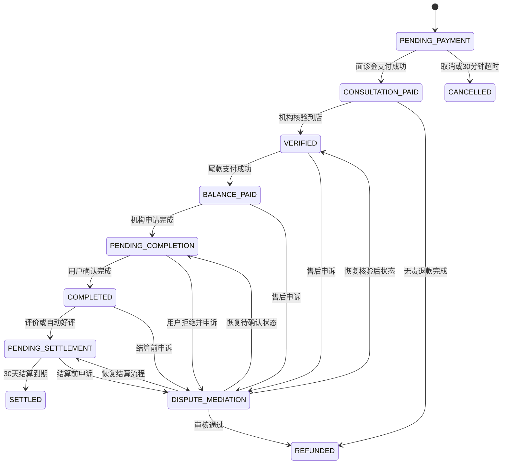
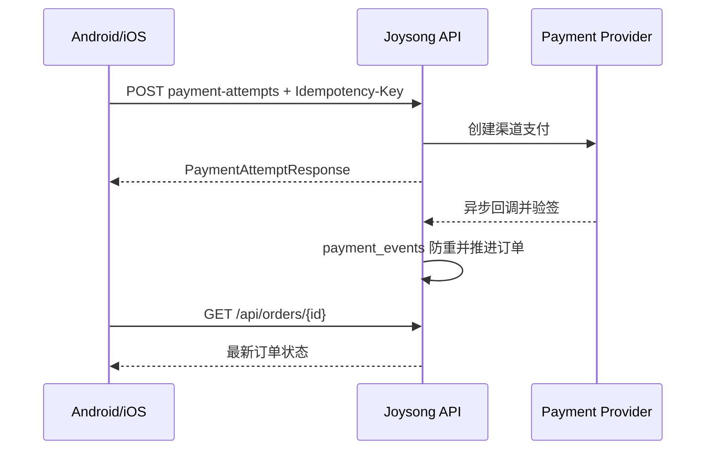
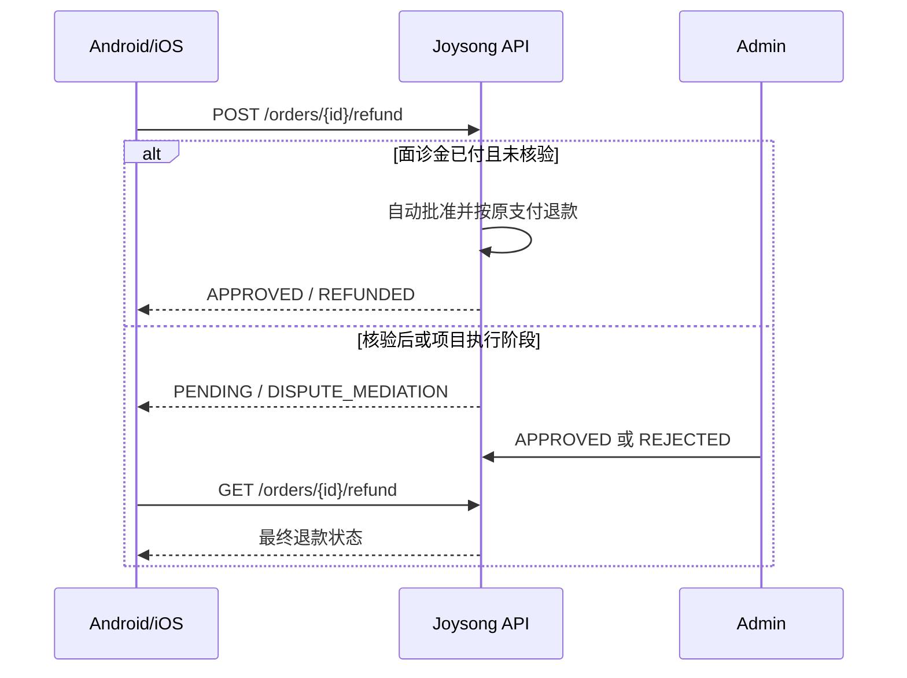

# 订单、支付、退款前端接口接入文档

> 文档版本：2026-08-06  
> 适用端：Android、iOS/Flutter、机构/医生端、管理后台  
> 服务端模块：`joysong-server`  
> 业务流程基准：[`doc/order_dispute_flow.puml`](../doc/order_dispute_flow.puml)  
> 服务端落地方案：[`PAYMENT_IMPLEMENTATION_GUIDE.md`](./PAYMENT_IMPLEMENTATION_GUIDE.md)

## 1. 接入范围和当前能力

本文档覆盖以下业务：

- 用户创建、查询、取消和删除订单；
- 面诊金、尾款两阶段支付；
- 用户生成核销码，机构/医生端完成核验及申请项目完成；
- 用户退款申请、撤回，管理员审核；
- 订单状态日志和后台结算查询；
- 支付渠道异步回调。

当前渠道能力：

| Provider | 枚举值 | 当前状态 | 前端使用建议 |
| --- | --- | --- | --- |
| 本地演示 | `DEMO` | 可用，仅 `payment.mode=demo` | 仅开发和联调环境 |
| Stripe | `STRIPE` | 枚举及适配接口已预留，渠道实现未接入 | 暂不在生产端展示 |
| PayPal | `PAYPAL` | 枚举及适配接口已预留，渠道实现未接入 | 暂不在生产端展示 |
| 微信支付 | `WECHAT_PAY` | 枚举及适配接口已预留，渠道实现未接入 | 暂不在生产端展示 |
| 支付宝 | `ALIPAY` | 枚举及适配接口已预留，渠道实现未接入 | 暂不在生产端展示 |

未配置的支付渠道会返回 `PAYMENT_PROVIDER_UNAVAILABLE`，不会模拟成功。

## 2. 通用约定

### 2.1 请求头

除支付渠道回调外，接口均需要用户登录：

```http
Authorization: Bearer <access-token>
Content-Type: application/json
```

创建支付尝试还必须提供：

```http
Idempotency-Key: <8-100字符的唯一键>
```

建议客户端用 UUID 作为幂等键，例如：

```text
1a10a1e1-99c1-44e6-ac45-c7b303efa46f
```

同一次用户支付动作发生超时或网络重试时，必须复用原幂等键；用户明确重新发起一次支付时，才生成新键。

### 2.2 通用响应

```json
{
  "code": 200,
  "message": "success",
  "data": {}
}
```

| 字段 | 类型 | 说明 |
| --- | --- | --- |
| `code` | Int | 业务状态码，`200` 表示成功 |
| `message` | String | 成功信息、错误码或错误说明 |
| `data` | Any/null | 业务数据 |

注意：部分用户端历史接口即使业务失败，HTTP 状态仍可能为 `200`，真实业务码放在响应体 `code` 中。客户端必须同时检查 HTTP 状态和 `body.code`，不能只判断 HTTP 2xx。

### 2.3 时间和金额

- 时间采用 ISO-8601 本地时间，例如 `2026-08-06T15:07:47.336`，当前业务时区按 `Asia/Shanghai` 解释。
- 订单兼容字段 `amount`、`price`、`paidAmount` 等为十进制展示金额。
- 支付接口的 `amountMinor` 为最小货币单位整数，应作为支付金额的唯一计算依据。
- 示例：`currency=CNY, amountMinor=19900` 表示 `¥199.00`；`currency=JPY, amountMinor=199` 表示 `¥199`。
- 前端不要用浮点数重新计算支付、退款或分账金额。

### 2.4 分页

用户订单和机构订单列表使用：

| 参数 | 默认值 | 约束 |
| --- | --- | --- |
| `offset` | `0` | 大于等于 0 |
| `limit` | 用户端 `50`，管理端 `20` | 1-100 |

当前订单列表的 `data` 直接返回数组，不返回总数。

## 3. 订单状态

### 3.1 状态定义及中英文展示

| 状态 | 中文建议 | English label | 用户端说明 |
| --- | --- | --- | --- |
| `PENDING_PAYMENT` | 待支付面诊金 | Consultation payment pending | 30 分钟未支付自动取消 |
| `CONSULTATION_PAID` | 面诊金已付 | Consultation fee paid | 等待到店 |
| `VERIFIED` | 已到店核验 | Visit verified | 等待支付尾款 |
| `BALANCE_PAID` | 全款已付 | Fully paid | 等待机构执行项目 |
| `PENDING_COMPLETION` | 待确认完成 | Completion confirmation pending | 机构已申请完成 |
| `COMPLETED` | 已完成 | Completed | 用户端终态展示 |
| `DISPUTE_MEDIATION` | 售后处理中 | Dispute under review | 平台客服审核中 |
| `CANCELLED` | 已取消 | Cancelled | 终态 |
| `REFUNDED` | 已退款 | Refunded | 终态 |
| `PENDING_SETTLEMENT` | 待结算 | Settlement pending | 用户端接口映射为 `COMPLETED` |
| `SETTLED` | 已结算 | Settled | 用户端接口映射为 `COMPLETED` |

Android 和 iOS/Flutter 应使用同一套枚举映射，不直接展示服务端枚举字符串。

### 3.2 核心状态流转



`VERIFIED` 不能直接进入 `PENDING_COMPLETION`，必须先成功支付尾款并进入 `BALANCE_PAID`。

### 3.3 用户端操作矩阵

| 用户端收到的状态 | 推荐显示操作 |
| --- | --- |
| `PENDING_PAYMENT` | 支付面诊金、取消订单 |
| `CONSULTATION_PAID` | 生成/刷新核销码、申请退款 |
| `VERIFIED` | 支付尾款、提交售后申诉 |
| `BALANCE_PAID` | 查看订单、提交售后申诉 |
| `PENDING_COMPLETION` | 确认完成、提交售后申诉 |
| `COMPLETED` | 评价、查看评价；符合条件时提交售后申诉 |
| `DISPUTE_MEDIATION` | 查看退款/售后详情；退款为 `PENDING` 时可撤回 |
| `CANCELLED` | 删除订单 |
| `REFUNDED` | 查看退款结果、删除订单 |

退款审核中应隐藏核销码及查看凭证入口。

## 4. 用户端订单接口

### 4.1 创建订单

```http
POST /api/orders
```

请求：

```json
{
  "projectId": "project-id",
  "institutionProjectId": "institution-project-id",
  "doctorId": "doctor-id",
  "quantity": 1,
  "remark": "用户备注",
  "userCouponId": 12,
  "appointmentTime": "2026-08-10T10:00:00"
}
```

| 字段 | 必填 | 说明 |
| --- | --- | --- |
| `projectId` | 是 | 项目 ID |
| `institutionProjectId` | 否 | 机构项目 ID；选择医生时必须提供 |
| `doctorId` | 否 | 医生 ID，默认空字符串 |
| `quantity` | 否 | 1-99，默认 1 |
| `remark` | 否 | 最多 500 字 |
| `userCouponId` | 否 | 当前用户可用优惠券记录 ID |
| `appointmentTime` | 否 | 必须晚于当前时间；支持 ISO-8601，兼容 `yyyy-MM-dd HH:mm` |

成功后订单状态为 `PENDING_PAYMENT`。

### 4.2 查询订单列表

```http
GET /api/orders?status=PENDING_PAYMENT&offset=0&limit=50
```

- `status` 可选；不传表示全部。
- `data` 为 `OrderResponse[]`。
- 用户端不会收到 `PENDING_SETTLEMENT` 或 `SETTLED`，这两个内部状态统一返回 `COMPLETED`。

### 4.3 查询订单详情

```http
GET /api/orders/{orderId}
```

订单响应主要字段：

```json
{
  "code": 200,
  "message": "success",
  "data": {
    "id": "order-id",
    "orderNo": "JOY202608061507471234",
    "projectId": "project-id",
    "institutionId": "institution-id",
    "doctorId": "doctor-id",
    "institutionProjectId": "institution-project-id",
    "projectName": "项目名称",
    "institutionName": "机构名称",
    "amount": 1000.00,
    "price": 1000.00,
    "paidAmount": 100.00,
    "discountAmount": 0.00,
    "consultationFee": 100.00,
    "remainingAmount": 900.00,
    "status": "CONSULTATION_PAID",
    "verifyCode": "123456",
    "refundStatus": "NONE",
    "refundAmount": 0.00,
    "createdAt": "2026-08-06T15:07:47"
  }
}
```

`price` 与 `amount` 值相同，仅为兼容旧 Android 字段名。

### 4.4 取消待支付订单

```http
POST /api/orders/{orderId}/cancel
```

仅 `PENDING_PAYMENT` 可取消，取消后状态变为 `CANCELLED`，已占用优惠券会退回。

### 4.5 删除已结束订单

```http
DELETE /api/orders/{orderId}
```

仅允许删除已结束状态订单，服务端执行软删除。

### 4.6 查询状态日志

```http
GET /api/orders/{orderId}/status-logs
```

```json
{
  "id": 1,
  "orderId": "order-id",
  "fromStatus": "PENDING_PAYMENT",
  "toStatus": "CONSULTATION_PAID",
  "operatorId": "user-id",
  "operatorType": "USER",
  "remark": "支付面诊金",
  "createdAt": "2026-08-06T15:07:47"
}
```

`operatorType` 可能为 `USER`、`ADMIN`、`INSTITUTION`、`SYSTEM`。

## 5. 支付接口

### 5.1 创建支付尝试（新接口）

```http
POST /api/orders/{orderId}/payment-attempts
Idempotency-Key: 1a10a1e1-99c1-44e6-ac45-c7b303efa46f
```

请求：

```json
{
  "paymentType": "CONSULTATION_FEE",
  "provider": "DEMO",
  "paymentMethod": "ONLINE"
}
```

| 字段 | 可选值/说明 |
| --- | --- |
| `paymentType` | `CONSULTATION_FEE`、`BALANCE` |
| `provider` | `DEMO`、`STRIPE`、`PAYPAL`、`WECHAT_PAY`、`ALIPAY`；当前仅 `DEMO` 已实现 |
| `paymentMethod` | 最大 50 字符；当前演示值为 `ONLINE`，后续可使用 `CARD`、`PAYPAL` 等渠道值 |

成功响应：

```json
{
  "code": 200,
  "message": "success",
  "data": {
    "id": "payment-id",
    "orderId": "order-id",
    "paymentType": "CONSULTATION_FEE",
    "provider": "DEMO",
    "paymentMethod": "ONLINE",
    "currency": "CNY",
    "amountMinor": 10000,
    "status": "SUCCEEDED",
    "providerPaymentId": "demo_payment-id",
    "failureCode": null,
    "failureMessage": null,
    "nextAction": null,
    "expiresAt": null,
    "createdAt": "2026-08-06T15:07:47",
    "updatedAt": "2026-08-06T15:07:47"
  }
}
```

支付状态：

| 状态 | 前端处理 |
| --- | --- |
| `CREATED` | 已创建，等待渠道处理 |
| `REQUIRES_ACTION` | 需要用户继续操作；真实渠道接入后使用 |
| `PROCESSING` | 处理中，轮询订单详情 |
| `SUCCEEDED` | 支付成功，刷新订单详情 |
| `FAILED` | 支付失败，可展示 `failureCode/failureMessage` 并允许重新支付 |
| `CANCELLED` | 支付已取消 |
| `EXPIRED` | 支付已过期，使用新幂等键重新发起 |
| `PARTIALLY_REFUNDED` | 部分退款，通常不作为支付页即时状态展示 |
| `REFUNDED` | 已全部退款 |

状态推进规则：

- `CONSULTATION_FEE` 成功：订单 `PENDING_PAYMENT → CONSULTATION_PAID`；
- `BALANCE` 仅允许在订单为 `VERIFIED` 时支付；成功后 `VERIFIED → BALANCE_PAID`；
- 相同用户、相同幂等键重试返回原支付尝试；
- 同一幂等键被用于不同订单、阶段或渠道时返回 `IDEMPOTENCY_KEY_CONFLICT`；
- 同一订单阶段已有处理中支付时复用同渠道尝试；若切换渠道则返回 `PAYMENT_ATTEMPT_IN_PROGRESS`，避免重复扣款；
- 客户端支付超时后可用原幂等键再次调用本接口获取原结果，再查询订单详情确认最终状态。

### 5.2 查询支付状态

```http
GET /api/payments/{paymentId}?refresh=false
GET /api/orders/{orderId}/payments/latest?paymentType=CONSULTATION_FEE&refresh=false
```

- 默认只读取本地状态；`refresh=true` 会向渠道主动查单；
- `REQUIRES_ACTION` 时按 `nextAction.type` 调用对应双端 SDK 或打开跳转地址；
- `PROCESSING` 时建议客户端退避轮询，不要创建新的支付尝试；
- `SUCCEEDED` 后停止轮询并刷新订单详情。

`nextAction.type` 支持：`STRIPE_CLIENT_SECRET`、`REDIRECT`、`WECHAT_SDK_PARAMS`、`ALIPAY_ORDER_STRING`。

### 5.3 服务端确认支付

```http
POST /api/payments/{paymentId}/confirm
Idempotency-Key: 3e19b6c5-e4ad-4f69-8575-37058bf5cbea
```

主要用于 PayPal 买家授权后的服务端 capture/confirm。客户端重复提交同一支付确认不会生成新的渠道交易。

### 5.4 兼容支付接口

以下接口仅供现有客户端过渡，内部使用 `DEMO` 渠道，不应作为生产境外支付接口：

```http
POST /api/orders/{orderId}/pay-consultation
POST /api/orders/{orderId}/pay-balance
POST /api/orders/{orderId}/pay
```

`/pay` 请求体：

```json
{
  "method": "ONLINE"
}
```

新版本 Android 和 iOS/Flutter 应统一迁移到 `/payment-attempts`。

## 6. 到店核验与项目完成

### 6.1 用户生成核销码

```http
POST /api/orders/{orderId}/verification-code
```

- 仅 `CONSULTATION_PAID` 可调用；
- 返回更新后的 `OrderResponse`，核销码位于 `data.verifyCode`；
- 调用本接口不会推进订单状态；
- 兼容旧接口 `POST /api/orders/{orderId}/verify` 已废弃。

### 6.2 机构/医生端确认到店

```http
POST /api/management/orders/{orderId}/verify
```

```json
{
  "verificationCode": "123456"
}
```

- 核销码必须为 6 位数字；
- 仅管理该机构/订单的账号可调用；
- 成功后订单进入 `VERIFIED`，原核销码失效。

### 6.3 机构/医生端申请项目完成

尾款成功后服务端会生成第二个核销码。

```http
POST /api/management/orders/{orderId}/request-completion
```

```json
{
  "verificationCode": "654321"
}
```

- 仅 `BALANCE_PAID` 可调用；
- 成功后进入 `PENDING_COMPLETION`。

### 6.4 用户确认完成

```http
POST /api/orders/{orderId}/confirm-completion
```

- 仅订单所有者可调用；
- 仅 `PENDING_COMPLETION` 可确认；
- 成功后用户端状态为 `COMPLETED`。

## 7. 退款与售后接口

### 7.1 申请退款/售后

```http
POST /api/orders/{orderId}/refund
```

```json
{
  "reason": "行程变化",
  "reasonCode": "CUSTOMER_REQUEST",
  "description": "无法按预约时间到店",
  "evidenceUrl": "https://cdn.example/a.jpg,https://cdn.example/b.jpg"
}
```

| 字段 | 必填 | 约束 |
| --- | --- | --- |
| `reason` | 是 | 非空，当前兼容中文/英文展示文案 |
| `reasonCode` | 否但推荐 | 稳定业务码，客户端应优先提交 |
| `description` | 否 | 最多 1000 字 |
| `evidenceUrl` | 否 | 多个 URL 用英文逗号分隔，最多 5 张 |

推荐统一原因码：

| 原因码 | 中文 | English |
| --- | --- | --- |
| `CUSTOMER_REQUEST` | 用户主动申请 | Requested by customer |
| `DUPLICATE_PAYMENT` | 重复支付 | Duplicate payment |
| `FRAUD_SUSPECTED` | 疑似欺诈 | Suspected fraud |
| `SERVICE_NOT_PROVIDED` | 项目未实际执行 | Service not provided |
| `SERVICE_NOT_AS_DESCRIBED` | 服务与描述不符 | Service not as described |
| `ORDER_CANCELLED` | 订单取消 | Order cancelled |
| `OTHER` | 其他 | Other |

服务端和数据库均执行白名单校验；未传时归一化为 `OTHER`，非法值返回 `INVALID_REFUND_REASON_CODE`。Android 与 iOS/Flutter 必须保持原因码一致。

业务规则：

- `CONSULTATION_PAID`：无责退款，自动批准并原路退回，完成后订单进入 `REFUNDED`；
- `VERIFIED` 及之后：退款申请进入 `PENDING`，订单进入 `DISPUTE_MEDIATION`，等待管理员审核；
- 同一订单不能重复提交进行中的退款；
- 真实退款会按面诊金支付和尾款支付拆成多笔原路退款，前端只展示业务退款单汇总。

### 7.2 查询退款详情

```http
GET /api/orders/{orderId}/refund
```

主要响应字段：

```json
{
  "id": "refund-id",
  "refundNo": "RFD20260806150747123ABCDEF",
  "orderId": "order-id",
  "currency": "CNY",
  "amount": 100.00,
  "requestedAmountMinor": 10000,
  "refundedAmountMinor": 10000,
  "reason": "行程变化",
  "reasonCode": "CUSTOMER_REQUEST",
  "description": "无法按预约时间到店",
  "status": "APPROVED",
  "rejectReason": null,
  "requestedAt": "2026-08-06T15:07:47",
  "reviewedAt": null,
  "completedAt": "2026-08-06T15:07:48"
}
```

退款状态：

| 状态 | 中文建议 | English label | 可撤回 |
| --- | --- | --- | --- |
| `PENDING` | 退款审核中 | Refund under review | 是 |
| `APPROVED` | 退款已批准 | Refund approved | 否 |
| `REJECTED` | 退款被驳回 | Refund rejected | 否 |
| `CANCELLED` | 申请已撤回 | Refund request cancelled | 否 |
| `REFUND_PROCESSING` | 原路退款处理中 | Refund processing | 否 |

### 7.3 撤回退款申请

```http
POST /api/orders/{orderId}/cancel-refund
```

仅退款状态为 `PENDING` 时允许。成功后退款记录变为 `CANCELLED`，订单恢复申请前状态。

## 8. 机构/医生端订单接口

### 8.1 列表和详情

```http
GET /api/management/orders?status=CONSULTATION_PAID&offset=0&limit=20
GET /api/management/orders/{orderId}
```

- 返回调用账号有权管理的机构或医生订单；
- 管理端可看到真实 `PENDING_SETTLEMENT`、`SETTLED` 状态；
- 响应不会向管理账号直接返回用户核销码，核验动作必须提交扫码得到的码。

核验和申请完成接口参见第 6 节。

## 9. 管理后台接口

管理后台接口要求管理员权限。

### 9.1 退款列表

```http
GET /api/admin/refunds
```

返回退款汇总数组，包括订单、用户、机构、医生、审核、最小金额单位等字段。

### 9.2 审核退款

批准：

```http
PUT /api/admin/refunds/{refundId}/status

{
  "status": "APPROVED"
}
```

拒绝：

```http
PUT /api/admin/refunds/{refundId}/status

{
  "status": "REJECTED",
  "rejectReason": "证据不足，无法支持退款申请"
}
```

- 只接受 `APPROVED` 或 `REJECTED`；
- 拒绝时 `rejectReason` 必填；
- 只能审核 `PENDING` 记录，重复审核会失败；
- 批准后执行原路退款，完成后订单进入 `REFUNDED` 并退还优惠券；
- 拒绝后订单恢复退款申请前状态，`refundAmount` 清零。

### 9.3 订单与结算

```http
GET /api/admin/orders
GET /api/admin/orders/{orderId}/status-logs
GET /api/admin/settlements?page=0&size=20
```

结算接口仅面向后台，不应在用户端调用或展示。

## 10. 支付渠道回调（非前端接口）

```http
POST /api/payment-webhooks/{provider}
```

该接口仅供 Stripe、PayPal 等支付渠道服务器调用：

- 不需要用户 JWT；
- 必须由对应渠道适配器完成签名验证；
- 验签通过后，原始 JSON 事件写入 `payment_events`；
- 使用 `provider + providerEventId` 防止重复处理；
- 未实现验签的渠道返回 `PAYMENT_WEBHOOK_UNAVAILABLE`；
- 移动端和管理端不得主动调用或模拟该接口。

## 11. 常见错误码与客户端处理

| message/code | 含义 | 客户端建议 |
| --- | --- | --- |
| `PAYMENT_PROVIDER_UNAVAILABLE` | 渠道未配置或当前环境禁用 | 隐藏渠道或提示暂不可用，不要自动改用 DEMO |
| `UNSUPPORTED_PAYMENT_PROVIDER` | 不支持的渠道枚举 | 上报客户端版本/配置错误 |
| `INVALID_IDEMPOTENCY_KEY` | 幂等键长度或格式无效 | 生成 UUID 后重试 |
| `IDEMPOTENCY_KEY_CONFLICT` | 幂等键被用于不同支付请求 | 为新的支付动作生成新键 |
| `INVALID_PAYMENT_METHOD` | 支付方式为空或过长 | 修正请求参数 |
| `PAYMENT_AMOUNT_NOT_POSITIVE` | 当前阶段应付金额不大于 0 | 刷新订单，停止发起支付 |
| `PAYMENT_NOT_FOUND` | 渠道支付记录不存在 | 刷新订单并上报日志 |
| `INVALID_PAYMENT_STATUS` | 支付状态不能执行当前动作 | 刷新订单/支付状态 |
| `INVALID_CURRENCY` | 币种代码非法 | 修正客户端或商品配置 |
| `INVALID_PAYMENT_AMOUNT_PRECISION` | 金额小数位超过币种规则 | 停止支付并上报服务端配置错误 |
| `退款证据最多上传5张` | 图片数量超限 | 限制为最多 5 张 |
| `该订单已有进行中的退款申请，请勿重复提交` | 重复退款 | 跳转退款详情 |
| `当前退款状态不允许取消` | 退款已审核或已处理 | 刷新退款详情，隐藏撤回按钮 |
| `PAYMENT_WEBHOOK_UNAVAILABLE` | 渠道回调验签未实现 | 仅服务端/运维处理 |

认证失败使用 HTTP/业务码 `401`；权限不足使用 `403`；资源不存在通常为 `404`。

前端应使用错误码映射中英文文案，不应直接把英文错误码展示给用户。

## 12. 推荐前端调用时序

### 12.1 支付



### 12.2 退款



## 13. 当前接入边界

前端可以立即完成 DEMO 环境的订单、两阶段支付、核验、退款和结算状态联调。

统一支付内核、查询/确认接口、客户端下一步动作协议、短事务退款和状态补偿已完成。真实境外支付上线前还需要服务端完成：

1. Stripe/PayPal 渠道 SDK、商户密钥和 webhook 验签；
2. 各渠道商户配置、回调域名、签名证书和沙箱验收；
3. Android 与 iOS/Flutter 同步接入支付渠道原生 SDK，并保持同一状态和错误码映射；
4. 渠道日账单下载、差异处理、监控与告警。

在这些能力完成前，生产环境不应向用户展示尚未实现的支付渠道。
